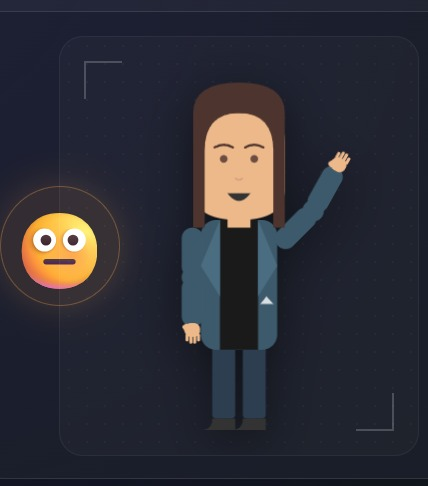

# Uyariy Sumak 👂 ("Escuchar Bien")

**Uyariy Sumak** (que en Quechua significa "Escuchar bien" o "Buen escuchar") es un traductor interactivo e inteligente de texto y voz a **Lengua de Señas Argentina (LSA)**. 

Este proyecto nace con la idea de acercar a la comunidad oyente y a las personas sordas, facilitando la accesibilidad a través de un diseño moderno y un avatar amigable.

---

## 🚀 Cómo lo construimos

El desarrollo del proyecto se enfocó fuertemente en lograr una interfaz pulida y un funcionamiento fluido en el navegador sin depender de librerías pesadas:

*   **Tecnologías Nativas:** Construido enteramente en **HTML5**, **CSS3 (Vanilla)** y **JavaScript (Vanilla)** para asegurar un altísimo rendimiento y tiempos de carga nulos.
*   **Estética Moderna:** El diseño está inspirado en tendencias modernas como el *Glassmorphism*, con paletas de colores oscuras contrastadas con luces de neón y animaciones sutiles.
*   **Reconocimiento de Voz Nativo:** Integramos la `Web Speech API` para que la aplicación escuche y procese comandos de voz en tiempo real.
*   **El Avatar Interactivo (Ramón):** Creamos un sistema visual basado en SVG que reacciona a lo que el usuario escribe o dice. Puede cambiar su expresión facial si la oración es alegre, triste o una pregunta; además de mostrar animaciones cuando "escribe" en el teclado o se "pone los auriculares" para escuchar.
*   **Motor de Traducción Dual:** El sistema identifica si una palabra tiene un **concepto** asociado (una seña específica en el diccionario) o si requiere **dactilología** (deletreo manual letra por letra).
*   **Accesibilidad (UX):** Creamos un scroll horizontal adaptativo que responde naturalmente a la rueda del ratón y un **Súper Zoom de Traducción** que se activa con doble clic para ofrecer alta visibilidad.

---

## 🗺️ Futuro del Proyecto (Actualmente en Desarrollo)

¡Esto es solo el comienzo! Estamos trabajando activamente en expandir la capacidad y la riqueza cultural de nuestro avatar. En futuras actualizaciones estaremos añadiendo:

1.  **Geografía Local:** Señas oficiales para referirse a todas las **Provincias de Argentina** y sus principales ciudades.
2.  **Países y Regiones:** Señas para diferentes nacionalidades y banderas.
3.  **Números y Medidas:** Implementación de matemáticas, horas, edades y números complejos en LSA.
4.  **Cultura y Regionalismos:** Integración de "argentinismos", modismos locales, comidas típicas y expresiones de nuestro país que no suelen aparecer en traductores genéricos.

*¡Seguimos mejorando para construir una comunicación más inclusiva y accesible!*

---

## 🤖 El Gran Desafío: Darle Vida al Avatar

Como se puede observar en el panel principal, contamos con un área reservada para nuestro intérprete virtual. Actualmente, el personaje base ya está maquetado e integrado utilizando **código SVG**. 

Sin embargo, el verdadero reto técnico que tenemos por delante es lograr que este personaje **"hable" en Lengua de Señas de manera fluida y realista**. Esto implica un trabajo enorme de desarrollo y "entrenamiento" del modelo, ya que replicar una lengua visual-gestual conlleva una altísima complejidad:

*   **Cinemática de las Manos:** Programar la flexión individual de los 10 dedos, la rotación de las muñecas y las posiciones espaciales de las manos relativas al cuerpo de forma orgánica.
*   **Transiciones y Fluidez:** Conectar una seña con otra sin que el movimiento parezca robótico o cortado. Las manos deben viajar de forma natural entre palabras.
*   **Expresión Corporal Total:** La Lengua de Señas no se trata solo de las manos. Requiere sincronizar las cejas, la boca, la inclinación de la cabeza y los hombros (ya que muchos modificadores gramaticales se expresan con el rostro).

Es un desafío enorme a nivel de programación web y animaciones, pero es el paso clave para convertir a **Uyariy Sumak** en un traductor completo y verdaderamente expresivo.
